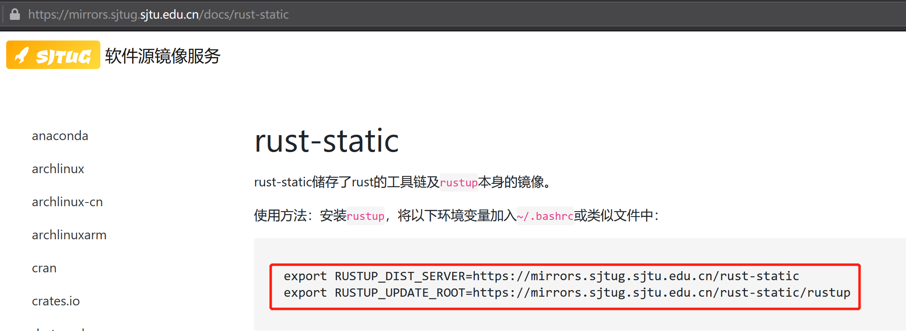
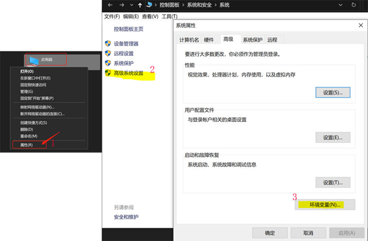
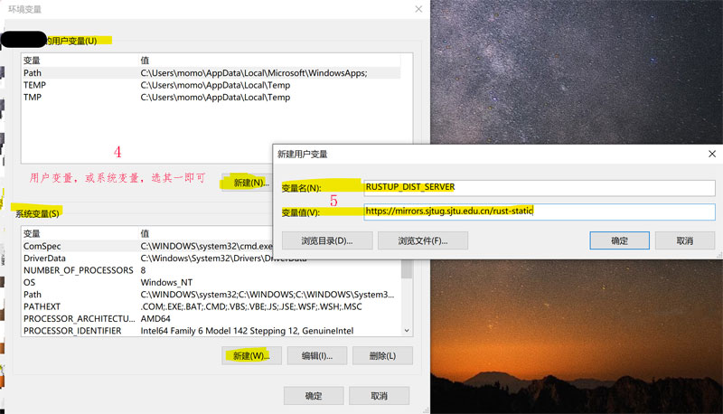

# 3.1. 配置 Rust 工具链的国内源

默认情况下，Rust 官方已经提供了工具链等资源的下载服务。

但是，Rust 官方服务器部署在北美洲，中国大陆用户下载速度较慢，甚至反复中断下载。因此笔者建议中国大陆用户使用国内镜像源，但如果你愿意等待较长时间，可以采用默认的官方源。

目前国内 Rust 工具链镜像源有：中国科学技术大学源、上海交通大学源、清华大学源，以及 rustcc 社区源。

> 读者可以前往笔者收集的 [Cargo 注册表源](https://cargo.budshome.com/reference/source-replacement.html#注册表源)，以查看即时更新的 Rust 工具链及 Cargo 相关资源的国内镜像源最新汇总。

本节仅介绍如何配置 `rust-static` 的国内镜像源，暂不考虑 Cargo 资源。Cargo 资源的国内镜像源配置，我们会在章节[ 4.1. 配置 cargo 国内镜像源](../4-cargo/4.1-source-replacement.md)中详细介绍。

下面，我们以上海交通大学的镜像地址为例，来了解如何配置 `rust-static` 的国内镜像源。

首先，打开网址 `https://mirrors.sjtug.sjtu.edu.cn/docs/rust-static`，我们可以看到上海交通大学提供的 Rust 工具链反向代理地址（红框内）及其使用帮助。如图 3.1-1 所示。



图 3.1-1

然后，我们配置自己机器中的环境变量，以在 Rust 工具链的执行中，采用上海交通大学的镜像源，而非默认的 Rust 官方源。不同的操作系统环境，配置过程稍有不同。

## 如果你是 Linux/WSL/macOS 操作系统

- 复制图 3.1-1 中红框内 2 行命令，然后直接在 shell 窗口执行：

``` shell
export RUSTUP_DIST_SERVER=https://mirrors.sjtug.sjtu.edu.cn/rust-static
export RUSTUP_UPDATE_ROOT=https://mirrors.sjtug.sjtu.edu.cn/rust-static/rustup
```

- 上述方式仅对当前 shell 窗口有效，在 shell 窗口重启后，需要重新配置才能生效。也可以将其存储到系统环境的个性化设置文件中，如 `.bashrc` 或 `.profile`。直接编辑你的个性化设置文件，在文件末尾增加上述 2 行。或者执行以下命令：

``` shell
echo "export RUSTUP_DIST_SERVER=https://mirrors.sjtug.sjtu.edu.cn/rust-static" >> ~/.bashrc
echo "export RUSTUP_UPDATE_ROOT=https://mirrors.sjtug.sjtu.edu.cn/rust-static/rustup" >> ~/.bashrc

source ~/.bashrc
```

## 如果你是 Windows 操作系统

- 仅需复制图 3.1-1 中红框内 2 行命令的 `export` 单词后的部分，然后直接在命令提示符（CMD）或者 powershell 窗口执行：

**如果是命令提示符（CMD）窗口，请执行：**

``` shell
set RUSTUP_DIST_SERVER=https://mirrors.sjtug.sjtu.edu.cn/rust-static
set RUSTUP_UPDATE_ROOT=https://mirrors.sjtug.sjtu.edu.cn/rust-static/rustup
```

**如果是 powershell 窗口，请执行：**

``` shell
$env:RUSTUP_DIST_SERVER=https://mirrors.sjtug.sjtu.edu.cn/rust-static
$env:RUSTUP_UPDATE_ROOT=https://mirrors.sjtug.sjtu.edu.cn/rust-static/rustup
```

- 上述方式仅对当前命令提示符（CMD）或者 powershell 窗口有效，在命令提示符（CMD）或者 powershell 窗口重启后，需要重新配置才能生效。也可以将其存储到 Windows 系统的用户变量或者系统变量中：

右键点击“此电脑”或者“我的电脑” -> 点击“高级系统设置” -> 点击“环境变量”，打开环境变量设置窗口。如下图 3.1-2 中的 1，2，3 标记处所示。



图 3.1-2

在“用户变量”或者“系统变量”区域（选其一即可），点击“新建”按钮，设置用户或系统的环境变量。分别增加“变量名”为 `RUSTUP_DIST_SERVER` 和 `RUSTUP_UPDATE_ROOT` 2 个变量，前者“变量值”为 `https://mirrors.sjtug.sjtu.edu.cn/rust-static`，后者“变量值”为 `https://mirrors.sjtug.sjtu.edu.cn/rust-static/rustup`。如下图 3.1-3 中的 4，5 标记处所示，示例图为 `RUSTUP_DIST_SERVER` 变量值的填写，不要忘记增加变量 `RUSTUP_UPDATE_ROOT`。



图 3.1-3

> 用户变量或环境变量保存后，需要重新打开命令提示符（CMD）或者 powershell 窗口才能生效。
