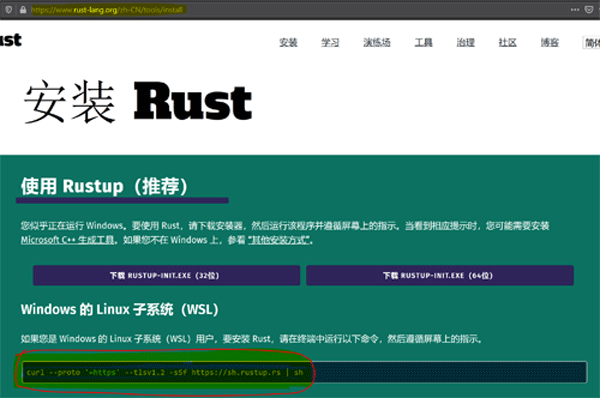
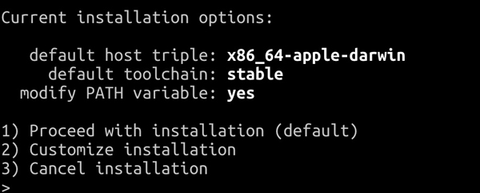
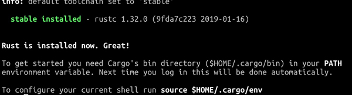

# 3.2.1. 命令方式安装 Rust

官方提供的命令方式安装 Rust，是最为推荐的。其可以安装 rustup、rustc，以及 Cargo 等工具，并主动配置环境变量。

<div class="warning">

注意：在 Linux/WSL、macOS、Windows 操作系统，配置 Rust 环境需要先安装 curl（文件传输工具）、gcc/g++（GNU的 c/c++ 编译器）软件包。

</div>

请先检查系统环境，如果未安装 curl、gcc/g++ 软件包，请在各自系统环境进行软件包的编译和安装。

``` shell
apt install curl, gcc # 或者 g++ // debian、ubuntu

yum install curl, gcc # 或者 g++ // redhat、centos

brew install curl, gcc # 或者 g++ // mac
```

上述命令仅供参考。通常，Linux 各发行版和 macOS 已经包含 curl 软件包，具体情况请根据您的操作系统环境处理。

## 3.2.1.1. 下载安装包，并进入安装状态

打开 Rust 官网安装页面 https://www.rust-lang.org/zh-CN/tools/install ，复制页面提示你执行的命令，其将适用于你的 Linux/WSL、macOS 环境。比如 Linux 平台环境，在官网页面可以看到和您操作系统相匹配的可执行命令，其和 WSL 环境安装命令是相同的。如图 3.2.1.1-1 所示。



图 3.2.1.1-1

> 根据机器、操作系统，以及安装软件及其版本等因素的情况，你看到的命令或许和书中有所差别。

- Linux/WSL 环境

``` shell
curl --proto '=https' --tlsv1.2 -sSf https://sh.rustup.rs | sh
```

- macOS 环境

``` shell
curl https://sh.rustup.rs -sSf | sh
```

然后我们只需要等待，如果你没有配置 Rust 工具链的国内源，默认为 Rust 官方源，安装包下载进度会比较慢。如果所报错误为不能成功下载安装包，请参考章节 [3.1. 配置 Rust 工具链的国内源](../3.1-rust-toolchain-cn.md)。安装包下载完成后，会自动进入安装状态。脚本会检测你的操作系统，然后提示你进行安装选项的选择。

## 3.2.1.2. 安装选项

下载安装包，并进入安装状态后，我们会看到大抵如此的界面。

> 此界面为 macOS 操作系统环境截图。Linux/WSL 操作系统中，`default host triple` 一项则有所不同。如图 3.2.1.2-1 所示。



图 3.2.1.2-1

- 选项 1 是默认选项。它是安装脚本对你的操作系统环境进行检测后，向你推荐的 Rust 安装选项。默认选项安装当前 Rust 最新的稳定版本（stable），并会主动更改你的环境变量。
- 选项 2 是自定义安装配置。在此选项中，你可以自定义安装，比如安装稳定版本（stable）还是每晚发布的版本（nightly），是否更改环境变量等。
- 选项 3 是取消安装。

`rustup` 工具非常强大，具备不同 Rust 版本管理的功能，因此你可以选择执行选项 1 或 2 任意一个，安装成功后，再使用 `rustup` 工具，通过版本管理的方式增加其它版本。

rustup 工具的使用方法，可以使用 `rustup help` 命令方便地查阅，并且没有需要特别注意的细节，因此我们不做详细涉及。

在此，我们选择默认安装。

> 若安装编译报错，请检查是否已经安装软件包 gcc 或 g++。

## 3.2.1.3. 执行 `source` 命令

安装完成后，可以看到安装成功的提示信息（注意你的日期部分会和笔者的显示不同）。如下图 3.2.1.3-1 所示：



图 3.2.1.3-1

请注意底行的 `To configure your current shell run source $HOME/.cargo/env`，根据提示，直接复制到 shell 窗口执行。

``` shell
source $HOME/.cargo/env
```

如果你希望详细查看安装包是否主动配置了你的环境变量，请检查你的 `.profile` 或 `.bashrc` 文件（通常是 `.profile` 文件），查看其末尾是否增加了 Cargo 环境变量。

最后，请打开 shell 窗口，运行命令 `rustc --version`、`cargo --version`、`rustup --version` 检测你的环境。如果可以看到 rustc、cargo，以及 rustup 的版本信息，并且没有提示任何错误信息，则表示已经成功安装。

至此，官方命令方式安装 Rust 已经完成。
