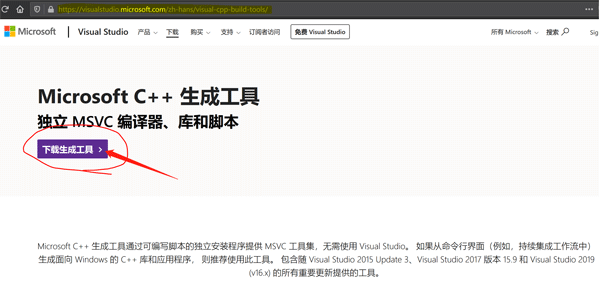

# 3.3.1. 安装 Microsoft C++ 生成工具

打开 Rust 官网安装页面 https://www.rust-lang.org/zh-CN/tools/install ，根据官网指示的 `Microsoft C++ 生成工具`链接地址下载 Microsoft C++ 生成工具。如图 3.3.1-1 所示。

图 3.3.1-1

Microsoft C++ 生成工具下载完成后，请根据提示安装，其耗时较长，请耐心等待。
