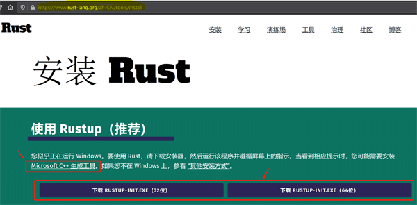
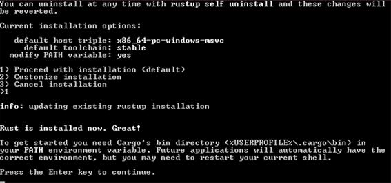

# 3.3.2. rustup 安装器

## 3.3.2.1. 获取 `rustup-init.exe`

在 Windows 操作系统环境中，可以使用 Rust 官方提供的 `rustup-init` 工具，也可以使用 Windows 下的软件包管理器 Chocolatey 或 Scoop。

我们推荐使用 Rust 官方提供的 `rustup-init` 工具安装 Rust， Chocolatey 或 Scoop 不做涉及。

打开 Rust 官网安装页面 `https://www.rust-lang.org/zh-CN/tools/install`，根据您的 Windows 操作系统类型，下载对应的 32 位或 64 位 `rustup-init.exe`。如图 3.3.2.1-1 所示。

图 3.3.2.1-1

## 3.3.2.2. 运行 rustup-init

Microsoft C++ 生成工具安装完成后，运行官网获取的 `rustup-init.exe`。下面我们在命令提示符（CMD）窗口运行 `rustup-init.exe`，如果您喜欢并使用的是 powershell 窗口，其显示信息和操作步骤大抵相同。如图 3.3.2.2-1 所示。

图 3.3.2.2-1

- 选项 1 是默认选项。它是安装脚本对您的操作系统环境进行检测后，向您推荐的 Rust 安装选项。默认选项安装当前 Rust 最新的稳定版本（stable），并会主动更改您的环境变量。
- 选项 2 是自定义安装配置。在此选项中，您可以自定义安装，比如安装稳定版本（stable）还是每晚发布的版本（nightly），是否更改环境变量等。
- 选项 3 是取消安装。

`rustup` 工具非常强大，具备不同 Rust 版本管理的功能，因此您可以选择执行选项 1 或 2 任意一个，安装成功后，再使用 `rustup` 工具，通过版本管理的方式增加其它版本。

rustup 工具的使用方法，可以使用 `rustup help` 命令方便地查阅，并且没有需要特别注意的细节，因此我们不做详细涉及。

在此，我们选择默认安装。

安装完成后，Rust 和 Cargo 环境变量会添加到操作系统的环境变量中。请检查您的`系统环境变量`，`Path` 变量名的变量值中是否增加了 Rust 和 Cargo 环境变量。命令提示符（CMD）中，可以直接键入 `path` 来查看，当然您也可以跟随`配置 Rust 工具链的国内源（可选）`小节中的配置截图，来查看安装后环境变量的实际配置情况。

同时，由此也可以查看您机器中 Rust 及其 Cargo 等工具链的安装位置，一般是在 C 盘符的`用户`目录中。

一般情况下，Rust 及其 Cargo 的环境变量不会添加到您的`用户变量`中，但事情总有例外。如果您在`系统环境变量`的 `Path` 变量中未找到，请检查`用户变量`中的 `Path` 变量。

最后，请打开命令提示符（CMD）或者 powershell，运行命令 `rustc --version`、`cargo --version`、`rustup --version` 检测您的环境。如果可以看到 rustc、cargo，以及 rustup 的版本信息，并且没有提示任何错误信息，则表示已经成功安装。

至此，rustup 安装器已经在您的 Windows 平台成功安装 Rust。
