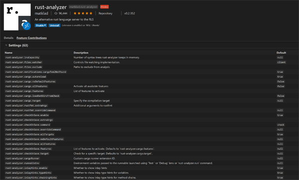
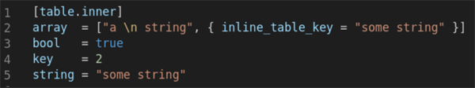
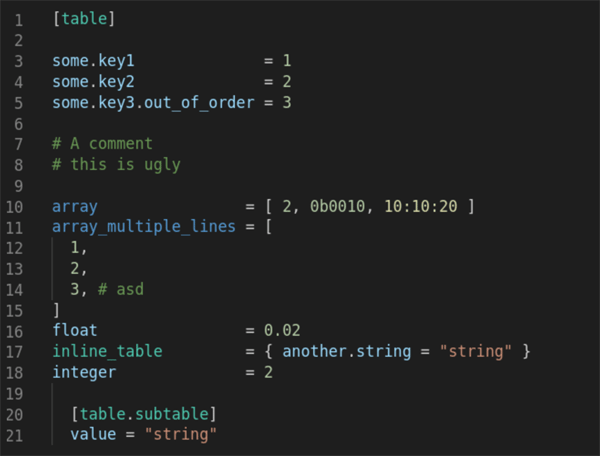
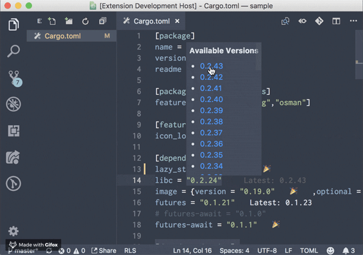
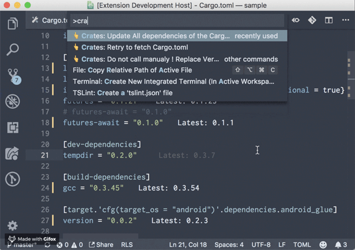

# 3.5.1. 编辑器及其扩展

本小节的内容是纲要性的功能简介。重点是介绍 Visual Studio Code 编辑器及其扩展，其可谓目前 Rust 开发中体验最好的工具，笔者最为推荐。在 Rust 开发中，Visual Studio Code 编辑器体验极好：运行速度快、界面美观简洁、布局合理。辅以 Rust 相关扩展，开发效率很高，用起来很趁手。

Visual Studio Code 编辑器的下载、安装，以及使用，网络资料很多，笔者不做涉及。笔者重点介绍其几种常用扩展，供读者参考。

此外，同类编辑器还有Atom、Sublime：Atom 编辑器是 Visual Studio Code 的基础，插件使用方式非常类似，但性能不太好；Sublime 性能极佳，但对 Rust 开发支持方面，插件性能较弱。

这几种编辑器都是著名的工具产品，所以截图不做详细放置，请读者自行搜索比较。

## 3.5.1.1. rust-analyzer

目前，Visual Studio Code 编辑器下最好的 RLS 服务器扩展，在此作为重点推荐。安装界面如图 2.5-1 所示。

图 3.5.1.1-1

rust-analyzer 提供了 rls 插件的大部分功能外，还支持以下特性：

- workspace 符号查找；
- 当前文档符号搜索；
- 输入辅助；
- 代码辅助；
- 结构体代码辅助；
- 自动添加缺失 trait 成员方法；
- 路径导入；
- 改变函数可见性；
- 填充模式匹配分支；
- Magic 填充等。

并且，rust-analyzer 插件相较于 rls 插件，性能具有很大优势。

rust-analyzer 扩展和 IntelliJ Rust 关系密切，rust-analyzer 扩展现在的主要负责人之一，是 IntelliJ Rust 团队的前技术负责人。

## 3.5.1.2. rust

Rust RLS 服务器扩展还有官方最早开发支持的编辑器扩展 Rust for vsCode。历时较长，支持特性丰富，但性能和体验不如 rust-analyzer，未来应该会和 rust-analyzer 统一：

- 代码补全；
- 代码跳转：跳转到定义，查看定义，查找所有引用，符号搜索；
- 悬停时的查看类型和文档；
- 代码格式化；
- 重构；
- 错误提示及建议；
- snippets；
- 构建任务等。

特性众多，功能完善且成熟，但性能有所欠缺。后来 Rust 官方新开了 rust-analyzer 插件项目，并且计划用来替代 rust 插件。

## 3.5.1.3. Even Better TOML

功能丰富的 toml 语言支持插件，帮助 Rust 开发者编辑 Rust 代码中的 toml 文件。支持语法高亮、代码扩展、语义分析、代码收缩，以及代码格式化等。

- 语法高亮，如图 3.5.1.3-1 所示；

图 3.5.1.3-1

- 代码格式化，如图 3.5.1.3-2 所示。

图 3.5.1.3-2

## 3.5.1.4. crates

crates.io 中各 crate 依赖项的扩展插件，在 Rust 开发者在使用 Cargo.toml 文件时，crates 插件可以辅助开发者管理依赖项。

- 更新单个依赖，如图 3.5.1.4-1 所示；

图 3.5.1.4-1

- 更新所有依赖，如图 3.5.1.4-2 所示。

图 3.5.1.4-2

## 3.5.1.5. LLDB VSCode

支持在 vsCode 中调试 Rust，请读者自行搜索安装。

## 3.5.1.6. 其它插件

比如 code9 插件等，也对在 vsCode 进行 Rust 开发有帮助。

读者可以在 vsCode 插件面板搜索 rust、crate 等，将会看到众多 Rust 开发辅助支持插件，筛选使用。
