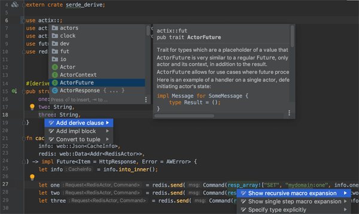
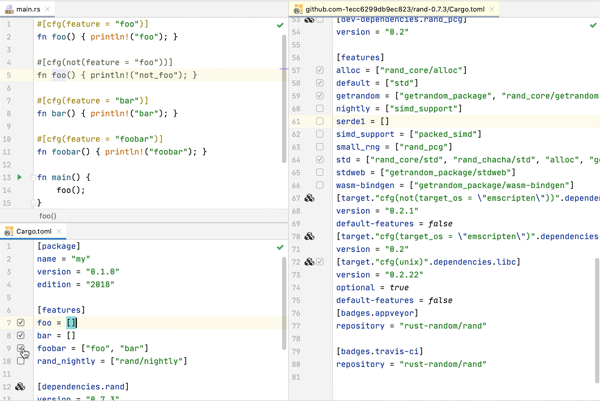
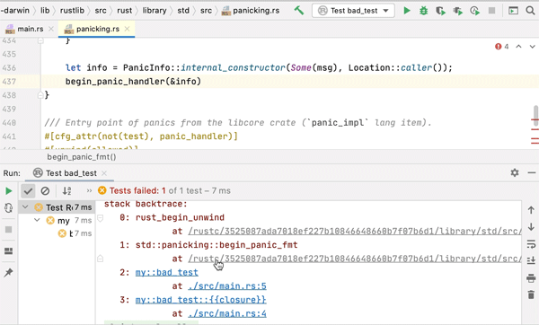

# 3.5.2. IDE 及其插件

IDE 巨头 Eclipse 和 IntelliJ 对 Rust 的开发支持非常热心，目前都有专门针对 Rust IDE 的独立项目，分别为 Eclipse IDE for Rust Developers 和 IntelliJ Rust。这两个 Rust IDE 功能强大，特性丰富，实现程度大抵相同，并且流行程度很高。因此本书不做详细介绍，仅提供信息，请读者自行搜索。下文通过 IntelliJ 官方支持的插件 IntelliJ Rust 做功能特性的简单展示，如图 3.5.2-1 所示。

图 3.5.2-1

除了基本的代码高亮、格式化、自动完成、错误提示外，最重要的特性有这几个：

- 代码跳转支持标准库和依赖的第三方库（神器，学 Rust 必需）。比如我们正在学 Vec，写了个 Vec::new()，既能跳到 Vec 这个 struct 的定义，也能跳到 new 函数的定义，看到对应的实现。IntelliJ Rust 同样支持通用的跳转和查找的快捷键，如双击 Shift 查找所有符号、Ctrl + N 查找类型（struct 和 trait）、Alt + F7 查找用处、Ctrl + Alt + B 查找实现（包括实现 trait 的 struct 和所有 impl 块）等。如图 3.5.2-2 所示。

图 3.5.2-2

- 支持调试 Rust 程序。Windows平台需要MinGW+Rust GNU工具链的配合。如图 3.5.2-3 所示。

图 3.5.2-3

- 其它小功能。如变量类型提示、文档高亮、Alt + F7 查看代码结构、动态模板、重构等。
