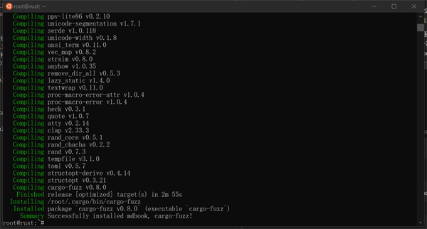

# 4.2. 使用 cargo 管理 crate

可以通过 `cargo install` 和 `cargo uninstall` 管理本地环境可执行 crate。

`cargo install` 用于在本地环境安装可执行 crate。Linux/WSL、macOS 环境默认路径为 `$HOME/.cargo/bin`，Windows 环境默认路径为 `%USERPROFILE%\.cargo\bin`。

本书附录中，我们将会实践 Rust 的模糊测试库 cargo-fuzz，我们既可以通过 `cargo install cargo-fuzz` 来将其可执行程序安装到本地环境。如果需要一次安装多个，通过空格分隔即可，假设我们也需要安装 Rust 语言开发的优秀书籍构建工具 mdbook。执行如下图 4.2-1 所示命令：

图 4.2-1

在图 4.2-1 中，各处标记反映了如下信息——

- 标记 1 处为我们将要执行的安装命令 `cargo install mdbook cargo-fuzz`，我们要将 mdbook 和 cargo-fuzz 的可执行程序安装到本地环境。
- 标记 2 处信息表示当前使用的 Cargo 源服务器地址，笔者使用的是中国科学技术大学提供的 Cargo 镜像源。
- 标记 3 处表示 mdboo、cargo-fuzz 这 2 个可执行 crate 安装时，需要依赖编译的 crate 数量，我们可以看到达到了 253 个依赖项。
- 另外，安装过程中，我们还可以看到分为下载和编译 2 个阶段。 

当安装完成后，会在命令窗口底部提示安装路径，版本等信息。如图 4.2-2 底部 2 行所示。

图 4.2-2

我们根据图 4.2-2 中提示的 crate 安装后的路径，查看是否安装成功。执行查看命令 ll（Windows CMD 窗口请使用 dir）查看安装位置所在目录，如图 4.2-3 所示，2 个红框内的可执行程序，表示已经安装成功。

图 4.2-3

如果需要卸载本地环境的可执行程序 cargo-fuzz，执行 `cargo uninstall cargo-fuzz` 命令即可。同样，可以一次卸载多个本地环境的可执行程序。如图 4.2-4 所示。

图 4.2-4
