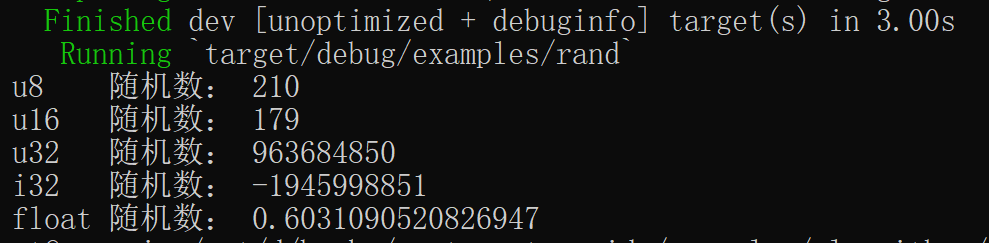

### 5.1.3.1. 生成随机数

[![rand-badge]][rand] [![cat-science-badge]][cat-science]

在随机数生成器 [`rand::Rng`] 的帮助下，通过 [`rand::thread_rng`] 生成随机数。可以开启多个线程，每个线程都有一个初始化的生成器。整数在其类型范围内均匀分布，浮点数是从 0 均匀分布到 1，但不包括 1。

- `rand::Rng`：`RngCore` 上自动实现的扩展 trait，为抽样取值和其它便捷方法实现了高层次的泛型方法。
- `rand::thread_rng`：创建随机数生成器线程的函数。调用后，由系统创建延迟初始化的本地线程。随机生成器线程将用于方法链（method chaining）样式，如 `thread_rng().gen::<i32>()`。或本地缓存，如 `let mut rng = thread_rng();`。由 `Default` trait 调用，等效于 `ThreadRng::default()`。

> 以下实例代码引用自 rust-cookbook 项目，笔者在其基础上稍作修改。

```rust,edition2018
{{ #include ../../../examples/algorithms/randomness/examples/rand.rs }}
```

代码第 1 行，我们使用 `use` 关键字将 `rand::Rng` 引入作用域。`rand::Rng` 是在 `RngCore` trait 上自动实现的扩展 trait，它实现了高层次的泛型方法。

代码第 4 行，由系统创建本地线程，作用为延迟初始化的随机数生成器。

代码第 6，7 行，均为返回支持标准分布的随机值，分别是 u8，u16 的无符号整型。

构建并运行后，结果大抵如图 3.1-1 所示，但具体值和笔者运行结果不一定相同。



图 3.1-1

[`rand::Rng`]: https://docs.rs/rand/*/rand/trait.Rng.html
[`rand::thread_rng`]: https://docs.rs/rand/*/rand/fn.thread_rng.html
