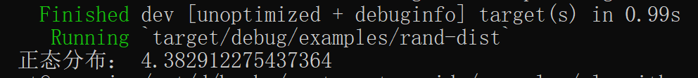

### 5.1.3.3. 生成给定分布随机数

[![rand_distr-badge]][rand_distr] [![cat-science-badge]][cat-science]

默认情况下，随机数在 `rand` crate 中是[均匀分布][uniform distribution]。[`rand_distr`] crate 提供其它的分布类型。如要使用，首先实例化一个分布，然后在随机数生成器 [`rand::Rng`] 的帮助下，使用 [`Distribution::sample`] 从该分布中进行采样。

- 均匀分布：在概率论和统计学中，均匀分布也叫矩形分布，它是对称概率分布，在相同长度间隔的分布概率是可能相等的。
- `rand_distr`：rand_distr crate 是 `rand::distributions` 模块的一个超级集合，实现了诸多概率分布类型，如均匀分布、正态分布（Normal distribution）、柯西分布（Cauchy distribution）等。请参考本章 “crate 介绍”一节。
- `Distribution::sample`：此函数创建一个迭代器，用来生成泛型 T 的随机值，其使用 `rng` 作为随机来源。

关于更多信息，可阅读相关[可用分布文档][rand-distributions]。如下是一个使用[`正态（Normal）`][`Normal`]分布的实例。

> 以下实例代码引用自 rust-cookbook 项目，笔者在其基础上稍作修改。

```rust,edition2018
{{ #include ../../../examples/algorithms/randomness/examples/rand-dist.rs }}
```

代码第 1-5 行，分别为使用 `use` 将正态分布相关模块引入作用域，以及由系统创建本地线程，作用为延迟初始化的随机数生成器。

代码第 6，7 行，建立正态分布模型，以及使用通过正态分布 `rand_distr::{Distribution, Normal, NormalError}` trait 实现的 `sample` 方法从半开放范围（2.0，9.0）取随机值。

构建并运行后，结果大抵如图 3.1-5 所示，但具体值和笔者运行结果不一定相同。



图 3.1-5

[`Distribution::sample`]: https://docs.rs/rand/*/rand/distributions/trait.Distribution.html#tymethod.sample
[`Normal`]: https://docs.rs/rand_distr/*/rand_distr/struct.Normal.html
[`rand::Rng`]: https://docs.rs/rand/*/rand/trait.Rng.html
[`rand_distr`]: https://docs.rs/rand_distr/*/rand_distr/index.html
[rand-distributions]: https://docs.rs/rand_distr/*/rand_distr/index.html
[uniform distribution]: https://en.wikipedia.org/wiki/Uniform_distribution_(continuous)
