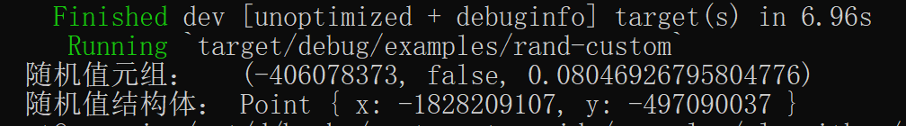

### 5.1.3.4. 生成自定义类型随机值

[![rand-badge]][rand] [![cat-science-badge]][cat-science]

随机生成一个元组 `(i32, bool, f64)` 和用户定义类型为 `Point` 的变量。为 [`Standard`] 实现 [`Distribution`] trait，以允许随机生成。

- `Standard`：通用的随机值分布结构体，为 rand crate 中的众多基本类型实现。通常生成均匀分布的数值，并且具有与类型相适应的范围。
- `Distribution`：创建概率分布类型的 trait，可以用来创建泛型 T 的随机实例的类型。提供 `sample_iter` 方法，该方法生成一个迭代器，从分布中采样。

> 以下实例代码引用自开源书籍项目《Cookin' with Rust》，笔者在其基础上稍作修改。

```rust,edition2018
{{ #include ../../../examples/algorithms/randomness/examples/rand-custom.rs }}
```

这段代码行数虽多，但逻辑不复杂。

代码第 1，2 行，使用 `use` 将相关模块引入作用域。

代码第 5-8 行，自定义一个结构体类型 `Point`。

最主要的是代码第 10-18 行，为 [`Standard`] 实现 [`Distribution`] trait，其中 [`Distribution`] trait 的类型为结构体 `Point`。这样可以在 `sample` 方法中，直接将产生的随机值封装到结构体 `Point`。

构建并运行后，结果大抵如图 3.1-6 所示，但具体值和笔者运行结果不一定相同。



图 3.1-6

[`Distribution`]: https://docs.rs/rand/*/rand/distributions/trait.Distribution.html
[`Standard`]: https://docs.rs/rand/*/rand/distributions/struct.Standard.html
