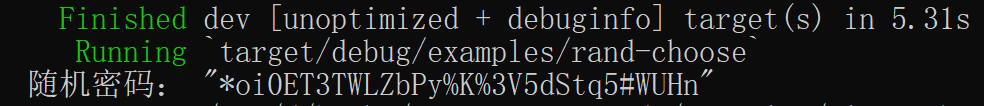

### 从一组用户定义字符创建随机密码

[![rand-badge]][rand] [![cat-os-badge]][cat-os]

使用用户自定义的字节字符串，使用 [`gen_range`] 函数，随机生成一个给定长度的 ASCII 字符串。

- `gen_range`：此函数在 `[低位，高位]` 范围内生成一个随机值。此范围为半开放范围，即包括`低位`而不包括`高位`。此函数针对给定范围内仅生成一个样本值的情况进行了优化。另外，此函数为均匀分布类型，如果从相同的范围重复抽样取值，执行速度将会更快。

> 以下实例代码引用自 rust-cookbook 项目，笔者在其基础上稍作修改。

```rust,edition2018
{{ #include ../../../examples/algorithms/randomness/examples/rand-choose.rs }}
```

代码第 1 行，我们使用 `use` 关键字将 `rand::Rng` 引入作用域。`rand::Rng` 是在 `RngCore` trait 上自动实现的扩展 trait，它实现了高层次的泛型方法。

代码第 3，4 行，自定义字节字符串样本，并设定密码长度。

代码第 11 行，通过 `0..PASSWORD_LEN` 匹配一个闭区间范围，其是密码字符串的长度。

代码第 12-15 行，首先在 `map` 方法内，通过闭包从自定义字节字符串样本中取随机值，其将根据密码字符串的长度迭代产生。然后通过 `collect` 方法绑定到变量 `password`。

构建并运行后，结果大抵如图 3.1-8 所示，但具体值和笔者运行结果不一定相同。



图 3.1-8

[`gen_range`]: https://docs.rs/rand/*/rand/trait.Rng.html#method.gen_range
