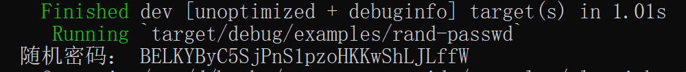

### 从一组字母数字字符创建随机密码

[![rand-badge]][rand] [![cat-os-badge]][cat-os]

随机生成一个给定长度的 ASCII 字符串，范围为 `A-Z，a-z，0-9`，使用[字母数字][`Alphanumeric`]样本。

> 以下实例代码引用自 rust-cookbook 项目，笔者在其基础上稍作修改。

```rust,edition2018
{{ #include ../../../examples/algorithms/randomness/examples/rand-passwd.rs }}
```

代码第 1，2 行使用 `use` 关键字将相关模块引入作用域，其中 `rand::distributions::Alphanumeric` 是[字母数字][`Alphanumeric`]样本，范围为 `A-Z，a-z，0-9`。

代码第 6，7 行使用 `sample_iter` 方法迭代从[字母数字][`Alphanumeric`]样本产生总长度为 30 的随机密码。

构建并运行后，结果大抵如图 3.1-7 所示，但具体值和笔者运行结果不一定相同。



图 3.1-7

[`Alphanumeric`]: https://docs.rs/rand/*/rand/distributions/struct.Alphanumeric.html
