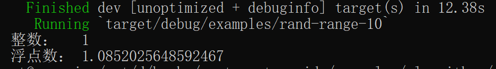
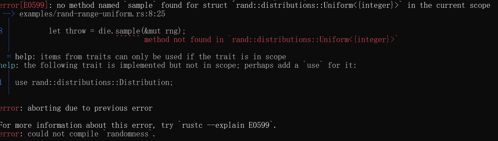
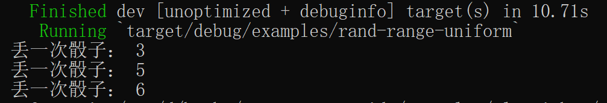

### 生成范围内随机数

[![rand-badge]][rand] [![cat-science-badge]][cat-science]

使用 [`Rng::gen_range`]，在半开放的 `[0, 10)` 范围内（不包括 `10`）生成一个随机值。

- `Rng::gen_range`：此函数在 `[低位，高位]` 范围内生成一个随机值。此范围为半开放范围，即包括`低位`而不包括`高位`。此函数针对给定范围内仅生成一个样本值的情况进行了优化。另外，此函数为均匀分布类型，如果从相同的范围重复抽样取值，执行速度将会更快。
- `Uniform`：样本值均匀地分布在两个界限之间的结构体。`Uniform::new` 和 `Uniform::new_inclusive` 构造给定范围内的均匀分布采样；这些函数可能会预先做一些额外的工作，以便更快地对多个值进行采样。**必须特别注意：确保四舍五入不会导致采样值小于（<）低位或者大于等于（>=）高位**。
- 均匀分布：在概率论和统计学中，均匀分布也叫矩形分布，它是对称概率分布，在相同长度间隔的分布概率是可能相等的。

> 以下实例代码引用自 rust-cookbook 项目，笔者在其基础上稍作修改。

```rust,edition2018
{{ #include ../../../examples/algorithms/randomness/examples/rand-range-10.rs }}
```

代码第 1 行，我们使用 `use` 关键字将 `rand::Rng` 引入作用域。`rand::Rng` 是在 `RngCore` trait 上自动实现的扩展 trait，它实现了高层次的泛型方法。

代码第 4 行，由系统创建本地线程，作用为延迟初始化的随机数生成器。

代码第 6，7 行，分别从半开放范围取整型（0，10）和浮点型（0.0，10.0）随机值，即包括`低位`而不包括`高位`。

构建并运行后，结果大抵如图 3.1-2 所示，但具体值和笔者运行结果不一定相同。



图 3.1-2

使用 [`Uniform`] 模块可以得到[均匀分布][uniform distribution]的值。下述代码和上述代码具有相同的效果，但在相同范围内重复生成数字时，下述代码性能可能会更好。

> 以下实例代码引用自 rust-cookbook 项目，笔者在其基础上稍作修改。

```rust,edition2018
{{ #include ../../../examples/algorithms/randomness/examples/rand-range-uniform.rs }}
```

本实例模拟丢骰子的程序。

代码第 1 行，我们使用 `use` 关键字将均匀分布模块 `rand::distributions::{Distribution, Uniform};` 引入作用域。

其中 `Distribution` trait 必须引入，其将自动实现随机值的取值方法。若不引入，代码第 8 行的 `sample` 方法将不能使用。如图 3.1-3 所示。 



图 3.1-3

代码第 4 行，由系统创建本地线程，作用为延迟初始化的随机数生成器。

代码第 5 行，制定了均匀分布取随机值的半开放范围（1，7），包括 `1` 而不包括 `7`。

代码第 8 行，使用 `Distribution` trait 实现的 `sample` 方法进行随机值的半开放范围取值。

构建并运行后，结果大抵如图 3.1-4 所示，但具体值和笔者运行结果不一定相同。



图 3.1-4

[`Uniform`]: https://docs.rs/rand/*/rand/distributions/uniform/struct.Uniform.html
[`Rng::gen_range`]: https://doc.rust-lang.org/rand/*/rand/trait.Rng.html#method.gen_range
[uniform distribution]: https://en.wikipedia.org/wiki/Uniform_distribution_(continuous)
