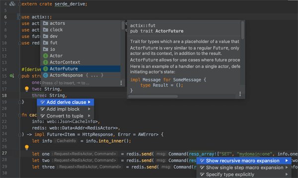
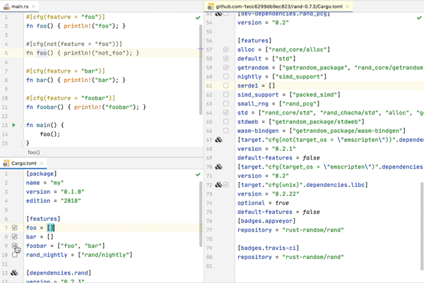
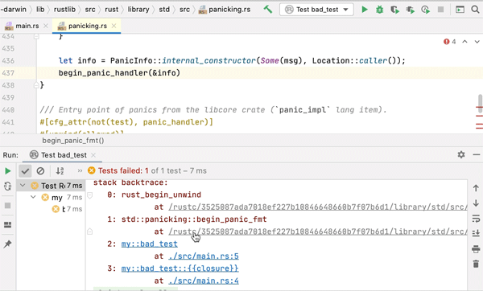

# 编辑器及 IDE

目前，支持 Rust 开发的工具越来越丰富。总体来说，主要分为编辑器和 IDE 两类。如以插件方式支持 Rust 开发的编辑器：Visual Studio Code、Atom、Sublime 等；官方开发项目，以插件方式支持 Rust 开发的 IDE：Eclipse IDE for Rust Developers、IntelliJ Rust。

另外，还有一些 Rust 专用的 IDE，但功能还不完善，或者说，笔者的使用体验感觉不如上文提及的编辑器和 IDE。因此，本书中不做赘述。

虽然从功能上来看，编辑器相较于 IDE，是被包含关系。但目前 Rust 开发方面来说，编辑器和 IDE 的开发体验，笔者感觉差别不是很大。笔者更推荐使用 Visual Studio Code 编辑器和其一众 Rust 支持插件的方式来进行 Rust 开发。所以本小节也会对 Visual Studio Code 及其 Rust 支持插件着墨较多。

但名声显要的 Eclipse 和 IntelliJ 开发的支持 Rust 的 Eclipse IDE for Rust Developers 和 IntelliJ Rust，也会做相应介绍，辅助读者比较选择。

> 注：本书中的实例开发、构建、调试、运行，以及发布，均与编辑器或者 IDE 无关。使用何种编辑器或者 IDE，仅是个人喜好。

## 编辑器

本小节所属编辑器都是著名的工具产品，所以截图不做详细放置，请读者自行搜索比较。

### Visual Studio Code（推荐）

Rust 开发中，笔者对 Visual Studio Code 编辑器比较推荐。运行速度快，界面体验好，布局合理。辅以 Rust 相关插件，开发效率很高，用起来很趁手。

Visual Studio Code 编辑器的下载、安装，以及使用，网络资料很多，笔者不做涉及。笔者主要从 Rust 相关插件做一个介绍。

#### rust

Rust 官方最早开发支持的 Visual Studio Code 编辑器的 Rust 插件。支持特性丰富：

- 代码补全；
- 代码跳转：跳转到定义，查看定义，查找所有引用，符号搜索；
- 悬停时的查看类型和文档；
- 代码格式化；
- 重构；
- 错误提示及建议；
- snippets；
- 构建任务等。

特性众多，功能完善且成熟，但性能有所欠缺。后来 Rust 官方新开了 rust-analyzer 插件项目，并且计划用来替代 rls。

#### rust-analyzer（推荐）

目前，Visual Studio Code 编辑器下最好的 RLS 服务器插件，提供 rls 插件的大部分功能外，还支持以下特性：

- workspace 符号查找；
- 当前文档符号搜索；
- 输入辅助；
- 代码辅助；
- 结构体代码辅助；
- 自动添加缺失 trait 成员方法；
- 路径导入；
- 改变函数可见性；
- 填充模式匹配分支；
- Magic 填充等。

并且，rust-analyzer 插件相较于 rls 插件，性能具有很大优势。

> rust-analyzer 插件的带头大哥，即是下文会展示截图的 IntelliJ Rust 团队的技术负责人。

#### Even Better TOML

功能丰富的 toml 语言支持插件，帮助 Rust 开发者编辑 Rust 代码中的 toml 文件。

#### crates

crates.io 中各 crate 依赖项的扩展插件，在 Rust 开发者在使用 Cargo.toml 文件时，crates 插件可以辅助开发者管理依赖项。

#### LLDB VSCode

支持在 vsCode 中调试 Rust，但目前还不成熟，使用体验较差。

#### 其它插件

比如 code9 插件等，也对在 vsCode 进行 Rust 开发有帮助。

读者可以在 vsCode 插件面板搜索 rust、crate 等，将会看到众多 Rust 开发辅助支持插件，筛选使用。

### Atom、Sublime

Atom 编辑器是 Visual Studio Code 的基础，插件使用方式非常类似，但性能不太好。

Sublime 性能极佳，但对 Rust 开发支持方面，插件性能较弱。

## IDE

功能强大，特性丰富的 IDE 巨头 Eclipse 和 IntelliJ，也对 Rust 开发非常热心，目前都有专门针对 Rust IDE 的独立项目。

除了基本的代码高亮、格式化、自动完成、错误提示外，最重要的特性有这几个：

- 代码跳转支持标准库和依赖的第三方库（神器，学 Rust 必需）。比如我们正在学 Vec，写了个 Vec::new()，既能跳到 Vec 这个 struct 的定义，也能跳到 new 函数的定义，看到对应的实现。IntelliJ Rust 同样支持通用的跳转和查找的快捷键，如双击 Shift 查找所有符号、Ctrl + N 查找类型（struct 和 trait）、Alt + F7 查找用处、Ctrl + Alt + B 查找实现（包括实现 trait 的 struct 和所有 impl 块）等。

- 支持调试 Rust 程序。Windows平台需要MinGW+Rust GNU工具链的配合。
- 其他小功能。如变量类型提示、文档高亮、Alt + F7 查看代码结构、动态模板、重构等。

