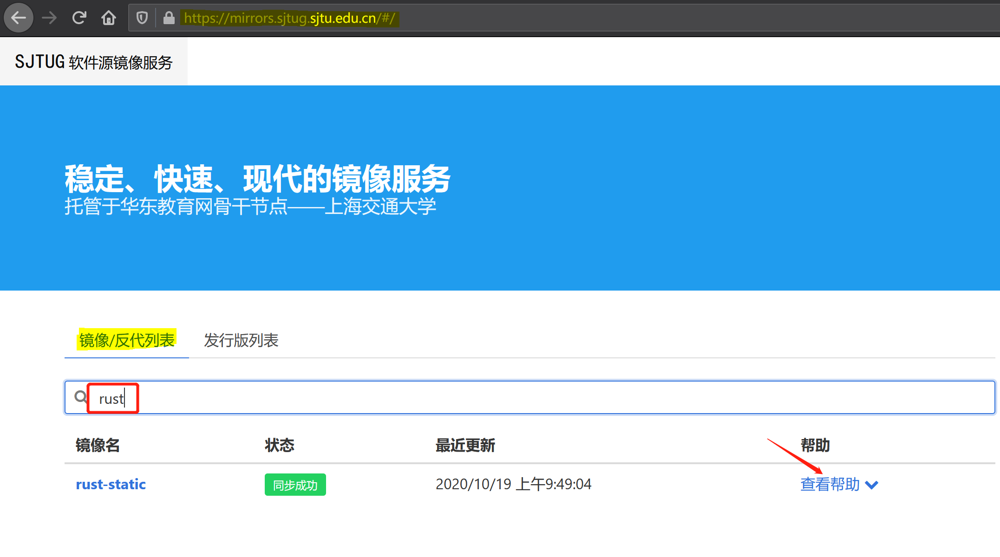
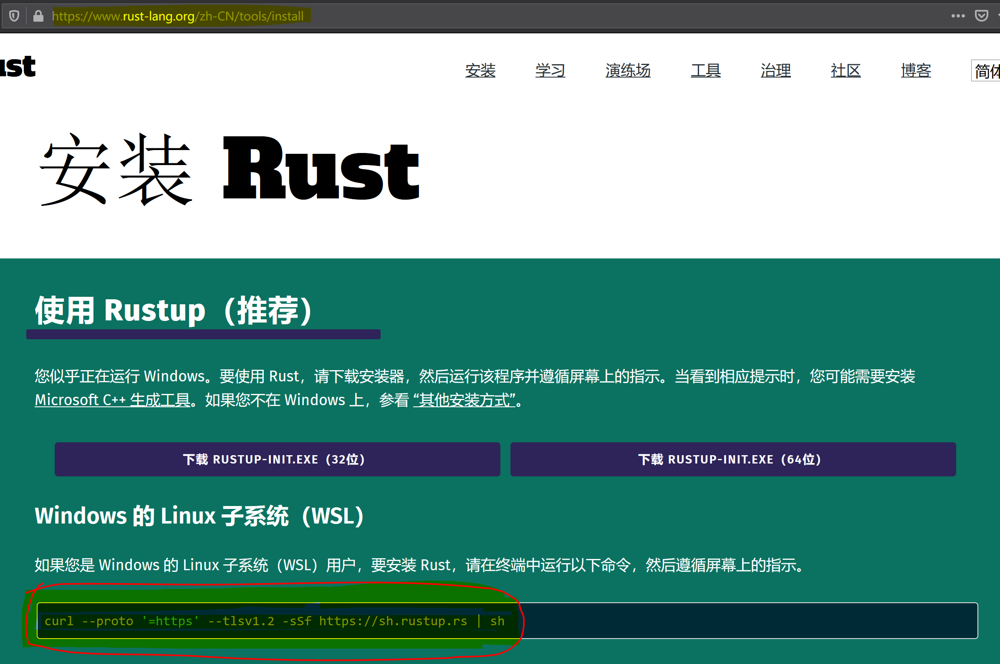
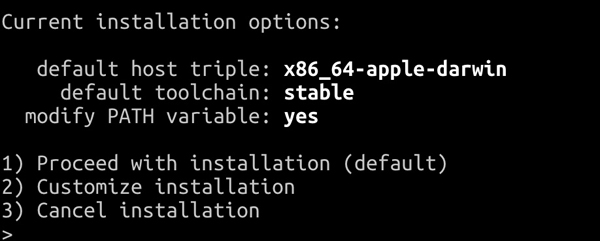
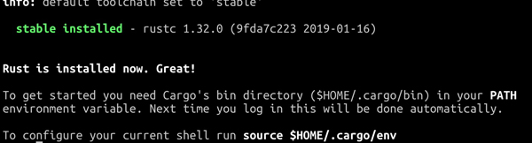
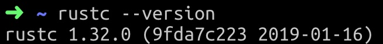

# Linux/WSL 或 macOS 环境安装、更新，和卸载 Rust

## 配置 Rust 工具链的国内源（可选）

中国大陆用户，因为网络原因，推荐使用国内镜像源。目前国内 cargo 镜像源有：清华大学源、中国科学技术大学源、上海交通大学源，以及 rustcc 社区源。

> 读者可以前往网址：`https://cargo.budshome.com/reference/source-replacement.html#注册表源` 查看即时更新的 Rust 工具链及 Cargo 相关资源的国内源地址。

目前仅是配置 rust-static 的国内源，暂不考虑 Cargo 资源。因此仅需要复制国内源地址的镜像域名地址，不需要其子目录，来查看这些国内源的使用方法。

下面，跟着我，以上海交通大学的镜像地址为例，来了解如何使用国内源。

### 查找

打开 `https://cargo.budshome.com/reference/source-replacement.html#注册表源`，复制并在浏览器打开上海交通大学镜像域名 `https://mirrors.sjtug.sjtu.edu.cn`（不要复制后面的子目录地址 `/git/crates.io-index`）。



- 点击`镜像/反代列表`标签，输入 `rust`；
- 在搜索结果中，可以看到镜像名 `rust-static`，其储存了 Rust 的工具链及 rustup 本身的镜像。
- 我们点击`查看帮助`，查看帮助文档。

### 配置

- 根据帮助文档的提示，我们可以直接在 shell 窗口执行：

``` shell
export RUSTUP_DIST_SERVER=https://mirrors.sjtug.sjtu.edu.cn/rust-static
export RUSTUP_UPDATE_ROOT=https://mirrors.sjtug.sjtu.edu.cn/rust-static/rustup
```

- 上述方式仅对当前 shell 窗口有效，在 shell 窗口重启后，需要重新配置才能生效。也可以将其存储到系统环境的个性化设置文件中，如 `.bashrc` 或 `.profile`。直接编辑你的个性化设置文件，在文件末尾增加上述 2 行。或者执行以下命令：

``` shell
echo "export RUSTUP_DIST_SERVER=https://mirrors.sjtug.sjtu.edu.cn/rust-static" >> ~/.bashrc
echo "export RUSTUP_UPDATE_ROOT=https://mirrors.sjtug.sjtu.edu.cn/rust-static/rustup" >> ~/.bashrc

source ~/.bashrc
```

当然，本小节国内源的配置，是可选建议。如果你连接境外网站网速尚可，或者你愿意等待，可以采用默认的官方源。

## 命令方式安装 Rust

官方提供的命令方式安装 Rust，是最为推荐的。其可以安装 rustup、rustc，以及 Cargo 等工具，并主动配置环境变量。

### 检查系统环境

检查系统是否已经安装 curl（文件传输工具）、gcc/g++（GNU的 c/c++ 编译器）软件包，如果未安装，请执行：

``` shell
sudo apt install curl, gcc # 或者 g++
```

### 安装 Rust

#### 下载安装包，并进入安装状态

打开 Rust 官网安装页面：https://www.rust-lang.org/zh-CN/tools/install，复制页面提示你执行的命令，其将适用于你的 Linux/WSL、macOS 环境。如下图所示为 WSL 环境安装 Rust 时，官网页面提示你执行的命令，其和 Linux 环境安装命令是相同的。



根据机器、操作系统，以及安装软件及其版本等因素的情况，你看到或许和别人稍有差别。比如笔者看到的命令为：

- Linux/WSL 环境

``` shell
curl --proto '=https' --tlsv1.2 -sSf https://sh.rustup.rs | sh
```

- macOS 环境

``` shell
curl https://sh.rustup.rs -sSf | sh
```

然后我们只需要等待：安装包下载完成后，会自动进入安装状态。脚本会检测你的操作系统，然后提示你进行安装选项的选择。

#### 安装选项

下载安装包，并进入安装状态后，我们会看到大抵如此的界面。

> 此界面为 macOS 操作系统环境截图。Linux/WSL 操作系统中，`default host triple` 一项则有所不同。



- 选项 1 是默认选项。它是安装脚本对你的操作系统环境进行检测后，向你推荐的 Rust 安装选项。默认选项安装当前 Rust 最新的稳定版本（stable），并会主动更改你的环境变量。
- 选项 2 是自定义安装配置。在此选项中，你可以自定义安装，比如安装稳定版本（stable）还是每晚发布的版本（nightly），是否更改环境变量等。
- 选项 3 是取消安装。

`rustup` 工具非常强大，具备不同 Rust 版本管理的功能，因此你可以选择执行选项 1 或 2 任意一个，安装成功后，再使用 `rustup` 工具，通过版本管理的方式增加其它版本。

rustup 工具的使用方法，可以使用 `rustup help` 命令方便地查阅，并且没有需要特别注意的细节，因此我们不做详细涉及。

在此，我们选择默认安装。

> 若安装编译报错，请检查是否已经安装软件包 gcc 或 g++。

安装完成后，请检查你的 `.profile` 或 `.bashrc` 文件——通常是 `.profile`——末尾是否增加了 Cargo 环境变量。

#### 安装检测

安装完成后，可以看到如下截图（注意你的日期部分会和笔者的显示不同）：



请注意底行的 `To configure your current shell run source $HOME/.cargo/env`，根据提示，直接复制到 shell 窗口执行。

``` shell
source $HOME/.cargo/env
```

至此，官方命令方式安装 Rust 已经完成，参考如下图片，检测你的环境。



如果可以看到 rustc 的版本信息，则已经安装完成（注意你的日期部分会和笔者的显示不同）。

## Homebrew 工具安装 Rust

Homebrew 是 macOS（或 Linux）缺失的软件包的管理器。虽然其已经可以使用在 Linux 环境，但主要使用群体还是 macOS 用户。因此，本小节内容也主要是面向 macOS 环境的开发者。

- 通过 brew 直接安装 Rust。此安装方式不能使用 rustup 工具来管理版本，所以**不推荐**，仅作为了解。

``` shell
brew install rust
```

- 我们希望使用官方提供的强大的 Rust 版本管理工具 `rustup`，因此我们通过 brew 安装 rustup 工具。

``` shell
brew install rustup-init
```

- 然后，在 bash 窗口执行 rustup 初始化命令，即可安装好 rust 环境及相关工具链。

``` shell
rustup-init
```

但是，brew 安装 rustup 工具后，也会接管 rustup 的更新及卸载。不能再使用 `rustup self update` 更新升级 rustup 工具。

## 更新 Rust

``` shell
rustup update
```

## 卸载 Rust

任何时候，如果你想卸载 Rust，可以运行命令：

``` shell
rustup self uninstall
```
