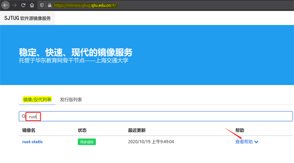
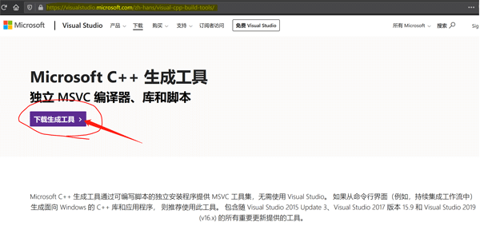
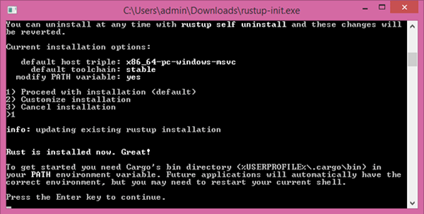

# Windows 配置 Rust 环境

## 配置 Rust 工具链的国内源（可选）

中国大陆用户，因为网络原因，推荐使用国内镜像源。目前国内 cargo 镜像源有：清华大学源、中国科学技术大学源、上海交通大学源，以及 rustcc 社区源。

> 读者可以前往网址：`https://cargo.budshome.com/reference/source-replacement.html#注册表源` 查看即时更新的 Rust 工具链及 Cargo 相关资源的国内源地址。

目前仅是配置 rust-static 的国内源，暂不考虑 Cargo 资源。因此仅需要复制国内源地址的镜像域名地址，不需要其子目录，来查看这些国内源的使用方法。

下面，跟着我，以上海交通大学的镜像地址为例，来了解如何使用国内源。

### 查找

打开 `https://cargo.budshome.com/reference/source-replacement.html#注册表源`，复制并在浏览器打开上海交通大学镜像域名 `https://mirrors.sjtug.sjtu.edu.cn`（不要复制后面的子目录地址 `/git/crates.io-index`）。



- 点击`镜像/反代列表`标签，输入 `rust`；
- 在搜索结果中，可以看到镜像名 `rust-static`，其储存了 Rust 的工具链及 rustup 本身的镜像。
- 我们点击`查看帮助`，查看帮助文档。

### 配置

- 根据帮助文档的提示，我们可以直接在命令提示符（CMD）或者 powershell 窗口执行：

如果是命令提示符（CMD）窗口，请执行：

``` shell
set RUSTUP_DIST_SERVER=https://mirrors.sjtug.sjtu.edu.cn/rust-static
set RUSTUP_UPDATE_ROOT=https://mirrors.sjtug.sjtu.edu.cn/rust-static/rustup
```

如果是 powershell 窗口，请执行：

``` shell
$env:RUSTUP_DIST_SERVER=https://mirrors.sjtug.sjtu.edu.cn/rust-static
$env:RUSTUP_UPDATE_ROOT=https://mirrors.sjtug.sjtu.edu.cn/rust-static/rustup
```

- 上述方式仅对当前命令提示符（CMD）或者 powershell 窗口有效，在命令提示符（CMD）或者 powershell 窗口重启后，需要重新配置才能生效。也可以将其存储到 Windows 系统的用户变量或者系统变量中：

右键点击“此电脑”或者“我的电脑” -> 点击“高级系统设置” -> 点击“环境变量”，打开环境变量设置窗口。如下图 1，2，3 标记处所示。


在“用户变量”或者“系统变量”区域（选其一即可），点击“新建”按钮，设置用户或系统的环境变量。分别增加“变量名”为 `RUSTUP_DIST_SERVER` 和 `RUSTUP_UPDATE_ROOT` 2 个变量，前者“变量值”为 `https://mirrors.sjtug.sjtu.edu.cn/rust-static`，后者“变量值”为 `https://mirrors.sjtug.sjtu.edu.cn/rust-static/rustup`。如下图 4，5 标记处所示，示例图为 `RUSTUP_DIST_SERVER` 变量值的填写，不要忘记增加变量 `RUSTUP_UPDATE_ROOT`。


> 用户变量或环境变量保存后，需要重新打开命令提示符（CMD）或者 powershell 窗口才能生效。

当然，本小节国内源的配置，是可选建议。如果你连接境外网站网速尚可，或者你愿意等待，可以采用默认的官方源。

## 官网获取 `rustup-init.exe`

在 Windows 操作系统环境中，可以使用 Rust 官方提供的 `rustup-init` 工具，也可以使用 Windows 下的软件包管理器 Chocolatey 或 Scoop。

我们推荐使用 Rust 官方提供的 `rustup-init` 工具安装 Rust， Chocolatey 或 Scoop 不做涉及。

打开 Rust 官网安装页面 `https://www.rust-lang.org/zh-CN/tools/install`，根据你的 Windows 操作系统类型，下载对应的 32 位或 64 位 `rustup-init.exe`。


Windows 操作系统环境中安装 Rust，需要下载 Microsoft C++ 生成工具。

## 安装 Microsoft C++ 生成工具

打开 Rust 官网安装页面：https://www.rust-lang.org/zh-CN/tools/install，根据官网指示的 `Microsoft C++ 生成工具`链接地址 https://visualstudio.microsoft.com/zh-hans/visual-cpp-build-tools，下载 Microsoft C++ 生成工具。



Microsoft C++ 生成工具下载完成后，请根据提示安装，其耗时较长。

## 运行 rustup-init

Microsoft C++ 生成工具安装完成后，运行官网获取的 `rustup-init.exe`。下面我们在命令提示符（CMD）窗口运行 `rustup-init.exe`，如果你喜欢并使用的是 powershell 窗口，其显示信息和操作步骤大抵相同。

> 在此，请读者忽略来源于网络的可爱的粉红色……



- 选项 1 是默认选项。它是安装脚本对你的操作系统环境进行检测后，向你推荐的 Rust 安装选项。默认选项安装当前 Rust 最新的稳定版本（stable），并会主动更改你的环境变量。
- 选项 2 是自定义安装配置。在此选项中，你可以自定义安装，比如安装稳定版本（stable）还是每晚发布的版本（nightly），是否更改环境变量等。
- 选项 3 是取消安装。

`rustup` 工具非常强大，具备不同 Rust 版本管理的功能，因此你可以选择执行选项 1 或 2 任意一个，安装成功后，再使用 `rustup` 工具，通过版本管理的方式增加其它版本。

rustup 工具的使用方法，可以使用 `rustup help` 命令方便地查阅，并且没有需要特别注意的细节，因此我们不做详细涉及。

在此，我们选择默认安装。

安装完成后，Rust 和 Cargo 环境变量会添加到操作系统的环境变量中。请检查你的`系统环境变量`，`Path` 变量名的变量值中是否增加了 Rust 和 Cargo 环境变量。命令提示符（CMD）中，可以直接键入 `path` 来查看，当然你也可以跟随`配置 Rust 工具链的国内源（可选）`小节中的配置截图，来查看安装后环境变量的实际配置情况。

同时，由此也可以查看你机器中 Rust 及其 Cargo 等工具链的安装位置，一般是在 C 盘符的`用户`目录中。

一般情况下，Rust 及其 Cargo 的环境变量不会添加到你的`用户变量`中，但事情总有例外。如果你在`系统环境变量`的 `Path` 变量中未找到，请检查`用户变量`中的 `Path` 变量。

## 安装检测

至此，官方命令方式安装 Rust 已经完成。打开命令提示符（CMD）或者 powershell，运行命令 `rustc --version`、`cargo --version`、`rustup --version` 检测你的环境，参考如下图片。


如果可以看到 rustc、cargo，以及 rustup 的版本信息，则已经安装完成（注意你的日期部分会和笔者的显示不同）。

## 更新 Rust

``` shell
rustup update
```

## 卸载 Rust

任何时候，如果你想卸载 Rust，可以运行命令：

``` shell
rustup self uninstall
```
